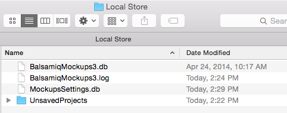
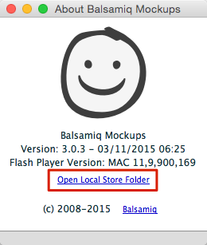

# 如何找到你的本地数据存储文件夹？

**最近已经上传完毕！** 
   
这篇网页是为了 [Balsamiq Mockups 3](https://balsamiq.com/products/mockups/) 而上传的。原来的文件您可以点击[这里](http://media.balsamiq.com/files/Balsamiq_Mockups_v1-v2_Docs.pdf)来观看。  

Balsamiq Mockups for Desktop 像许多其它应用一样，在您的硬盘上新建一个文件夹来储存本地数据和一些个人偏好。就像下图一样。

您最好不要打开这个文件夹，但在故障排查中可能会需要您来定位这个文件夹。找到它最简单的方式是打开 “About” 对话框并点击  "Open Local Store Folder" 链接。

仅供参考，以下是一些可运行 Balsamiq Mockups for Desktop 的操作系统中这个文件夹的位置：

- **在 Windows XP 操作系统中：**  
C:\Documents and Settings\<username>\Application Data\BalsamiqMockups3.EDE15CF69E11F7F7D45B5430C7D37CC6C3545E3C.1\Local Store

- **在 Mac OS X 操作系统中：**  
<your user home>/Library/Preferences/BalsamiqMockups3.EDE15CF69E11F7F7D45B5430C7D37CC6C3545E3C.1/Local Store

  **对 Mac OS X Lion 用户的提醒：** ~/Library 文件夹是默认隐藏的。想要使它再次可见，打开一个终端窗口并输入：
chflags nohidden ~/Library

- **对 Windows Vista 和其后版本操作系统中：**
C:\Users\<yourusername>\AppData\Roaming\BalsamiqMockups3.EDE15CF69E11F7F7D45B5430C7D37CC6C3545E3C.1\Local Store

在 Windows 7 操作系统中，如果您看不见 Documents and Settings 这个文件夹，您可能需要“显示隐藏系统文件”。  
1. 打开 Windows 资源管理器(Start+E)  
2. 选择菜单项 “Organize > Folder and search options.”  
3. 选择视图选项卡并且取消勾选“隐藏受保护的操作系统文件”
现在 Documents and Settings 文件夹应该出现在 Windows 资源管理器位置 C:\ 之下。如果没有出现，您也需要重新启动电脑。

- **在 Linux 操作系统中**:
~/.appdata/BalsamiqMockups3.EDE15CF69E11F7F7D45B5430C7D37CC6C3545E3C.1/Local Store
