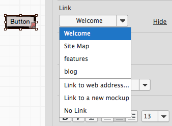
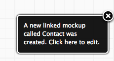
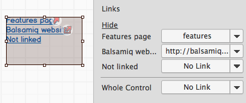

# 将Mockups链接起来

您可以将 mockups 链接起来，为你的网站或是软件应用创建一个简单的原型。当你以[全屏显示模式](http://support.balsamiq.com/customer/portal/articles/111756)或是[导出 PDF 方式](http://support.balsamiq.com/customer/portal/articles/111730#exportpdf)展示你的项目时，采用将 mockups 链接起来的方法，对展示点击原型或是可用性测试非常有效。

链接 mockups 就像在下拉菜单中选择 mockup 一样简单。简单的点击一个支持链接的控件（这是通常的做法，如果不这样做的话，[这里也有一个解决方案](http://support.balsamiq.com/customer/portal/articles/117684)）并且你将在[属性视图](http://support.balsamiq.com/customer/portal/articles/110114) 中看见一个 "Link" 下拉菜单（如果你没有看到，请点击 “查看链接视图”）。

项目中的列表已经预先填充了其他 mockups 的名称。选择其中一个并且链接到它。如果你想要链接到一个还没有创建的 mockup，点击 "Link to a new mockup"，然后一个新的 mockup 将会被创建，并且选中的控件会链接到该 mockup。这个新 mockup 的名字会以一个通知的形式来显示。点击该通知，将会转到这个 mockup 中。

你同样可以链接到网络 URLs，来展示链接到外部网站或是产品页面的链接。
你可以通过选择 "Link to web address..." 选项，并且在对话框中输入你要链接到的 URL ，来达到这个目的。

对于有多个链接目标的组件，你将看到如下情况：

**注意**:想要学习如何在其他控件中的文本字符串创建链接，请查看我们的文章 [making links in text actually work.](http://support.balsamiq.com/customer/portal/articles/110121#linking)

一旦你已经在下拉菜单中选择了一个 mockup 或是 网络页面来进行链接，组件将会在右下角显示一个小箭头。到 mockup 的链接会被现实为一个空白的箭头，而到网络页面的链接将是一个箭头周围有一个小盒子包围着它。如下所示：

当你链接至你的 mockups 时，你能够进入[全屏显示模式](http://support.balsamiq.com/customer/portal/articles/111756)，并且你可以点击你的链接来测试原型。

在全屏显示模型中，含有链接的组件将会有一个红色的叠加，并且当指针在其上经过时，将会出现一个大指针，并且伴随着链接到的目标文件或是网络页。（这个功能也可以在全屏显示模式设置面板中关闭）。

点击这个链接会直接到链接到的 mockup 文件 或是网络页面。网络链接将会在浏览器中的打开。

这里有一个短视频来展示将 mockups 链接起来的过程。

