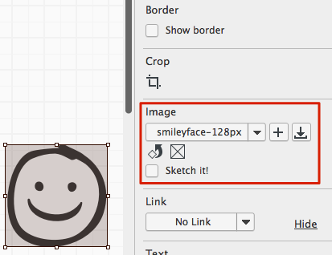

# 使用图像

有多种方式可以向你的 Mockups 中添加图像。最简单的方法只需要拖拽一个图片文件从你的电脑到你的 Mockups 画布上。来阅读一些更多在你的工程中添加并使用图像的方法吧。  
## 在 Mockups 视图中添加图像

正如上面提到的，从你的电脑上拖拽一个图像到 Balsamiq Mockups 会把它添加到你的画布上。这样做会将图片放在你选中的 Mockups 中并拷贝图像文件到你的 [Assets](http://support.balsamiq.com/customer/portal/articles/110401-working-with-images#assetsview) 目录中，所以你可以很轻松的重富使用它在其他 Mockups 上。  
你可以在 Property Inspector 中修改图片属性，和其他 UI 控制一样。  

图像的特定属性如下：  

- **下拉菜单**显示你当前图片的名字。打开它会允许你选择一个其他的你已经上传到 [Assets](http://support.balsamiq.com/customer/portal/articles/110401-working-with-images#assetsview) 目录中的图像。
- 在下拉菜单旁边的**"+"图标**允许你从你的电脑里添加一个图像。这与你拖拽一个图片进来效果相同。
- 单击**下载图标**打开一个对话框可以通过输入 URL 来从网络上直接或者从网络相册上搜索并添加图像。 Mockups 支持 GIF, JPG/JPEG, 和 PNG 图像格式。文件将从网上下载并复制到你的工程中。
- 单击下拉菜单下面的**旋转图标**每次让你的图像旋转90度
- 单击**方框中有一个叉的图标**将会还原你的图像成为一个默认的占位符图像。
- **素描它！复选框**将转换你的图像成为一个仅使用黑白线条描绘的版本。

