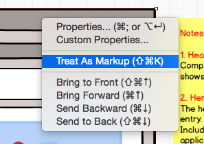

# 使用标记

**最近已经上传完毕！** 
   
这篇网页是为了 [Balsamiq Mockups 3](https://balsamiq.com/products/mockups/) 而上传的。原来的文件您可以点击[这里](http://media.balsamiq.com/files/Balsamiq_Mockups_v1-v2_Docs.pdf)来观看。

标记是 UI 库中一个特殊的组件，它用来添加注释、评论和解释说明性文字。  

通常情况下使用的标记有：箭头/下划线，插图编号，记事贴，红叉和花括号。下面的截图显示了 UI 库中提供的可选标记按钮面板，和在页面上的标记组件。  

## 锁定和隐藏标记

当你编辑你的标记时，你有时会想看一看没有标记时是什么样子的。你可以通过使用在工具栏右侧尽头的 Show/Hide 选项按钮实现。  
下面的插图显示了之前的页面在不显示标记时的样子。  

## 标记隐藏与锁定的快捷键

这里有快捷键来控制标记的可见或隐藏。  

在 Windows 下按 CTRL + K（在 MAC 下按 CMD + K）来开关显示标记。  

在全屏模式下你可以只按 “M”（或 “K”）键。  

## 使用选项标记和隐形标记

有时候你希望你的标记像没有一样，反之亦然。举个例子，你可以使用 iphone 控制作为设计给手机屏幕导航，但是当你提交它并在手机上浏览时，你可能想要隐藏 iphone 自身的样子。  

如果你想让你的标记像没有一样，在组件上单击右键在下拉菜单中选择 "Do Not Treat as Markup" 选项。这将允许组件可见无论标记可见选项是可见还是不可见。  

你可以使用 "Treat As Markup / Do Not Treat As Markup" 选项在任何组件上。如果你在任何一个普通组件上右键选择 "Treat as Markup"，它都可以像标记一样使用。它将在你选择标记标签为不可见时隐藏起来。  

下面的视频将演示这一过程：

## 将标记导出为 PNG 或 PDF  

如果你想在你导出的 PNG 图片或者 PDF 中显示或隐藏，只需要像上述那样选择标记可见并导出即可。
