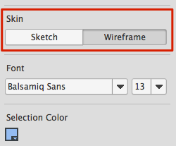
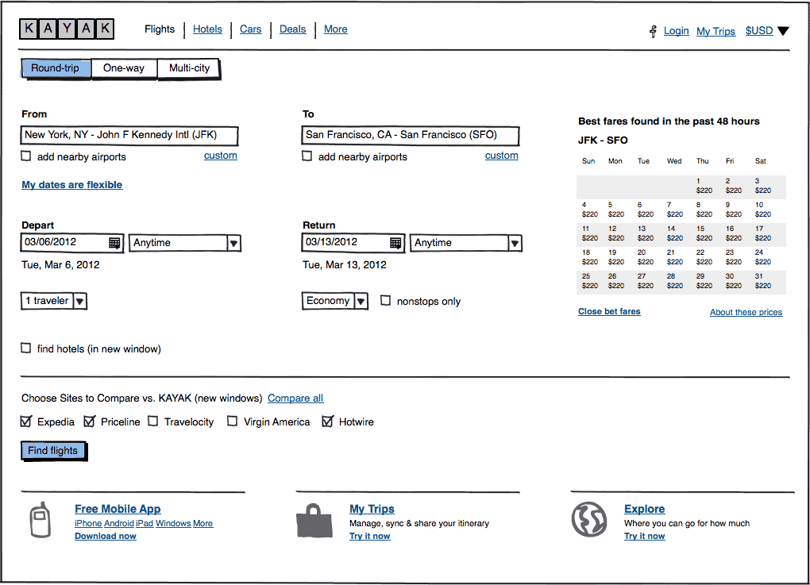
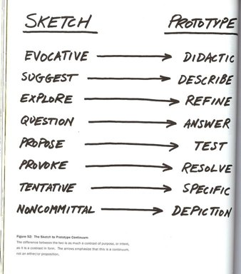

# 使用皮肤（sketch vs. wireframe）

我们知道一些人需要从内部团队中聚集想法，并且将最好的创意展现给客户或者是投资人，在这种情况下普通的 "sketch" 外表风格很难满足要求。应对这种需求，我们创建了一个 "wireframe" 外表风格，能够告别粗糙的手绘风格，取而代之的是更加鲜活，干净的线框元素。

## 从 sketch 转换为 wireframe 皮肤风格

想要转换外表风格，要到[项目信息面板](http://support.balsamiq.com/customer/portal/articles/1895403)并且将外表设置为 "Wireframe"。

这个特性允许你使用粗糙的外表风格来显示你的想法，然后再通过菜单选择外表风格，来将你所有的控件转换为干净的风格。其中包括图标的所有元素都会被转换。

下面的截图分别展示了两种风格的对比。可以点击图片看更加清晰地大图。

## 应该使哪种皮肤风格

很高兴你能够问这个问题;-) 简单的说，我们仍然认为在使用mockup时 sketch 皮肤风格在大多数时候更加合适。

我们添加 wireframe 皮肤风格的意图主要是给你的 Mockups 添加更多的逻辑性，这有利于展示给客户或是投资人，人们也许会不经意间对你努力相处的创意有所打折，仅仅因为你的展示就像是画在餐巾上的素描。我们不愿意你的努力工作被轻视，仅仅因为他看上去不够专业。

然而，当你在进行设计时，原始的 sketch 皮肤风格仍然提供它已经含有的所有优点。它故意的做成看上去非常粗糙，这是因为想要通过这样来鼓励设计者去尝试更多的创意去不断实验和修改来完成最好的设计。wireframe 皮肤风格能够很快的让你去完成一个特定的设计，因为他看起来就好像是已经完成的了，或者当你在考虑工作细节时，它会提示你调整对齐，字体颜色等。

wireframe 皮肤风格让你的设计看上去感觉已经完成，而 sketch 皮肤风格则让你的设计看上去还是不完美的，这将指引你继续提出问题并进行探索。下面对草图和原型的不同的描述同样可以应用到 sketch 和 wireframe 皮肤风格的不同。

因此，虽然你可以在设计过程中的任何阶段使用 wireframe 皮肤风格，但是我们不推荐用它代替 sketch 皮肤，而是将它作为 sketch 的一个后续。它扩展了 Mockups 的功能，使他更适合在产品开发过程中的演示或是推销，而不是构思和设计阶段。

在一开始，Balsamiq Mockups 就被优化成为产品设计阶段的[新颖点](http://balsamiq.com/products/mockups/#sweet)，并且在未来会继续如此。我们仍然没有任何计划去为我们的产品添加花哨的交互行为，我们非常满意我们现在做的事。

