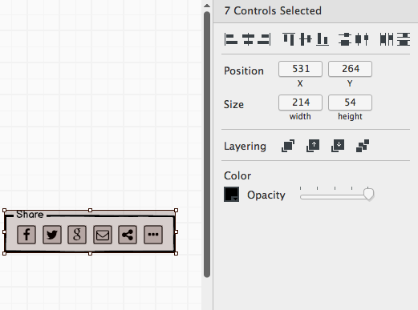
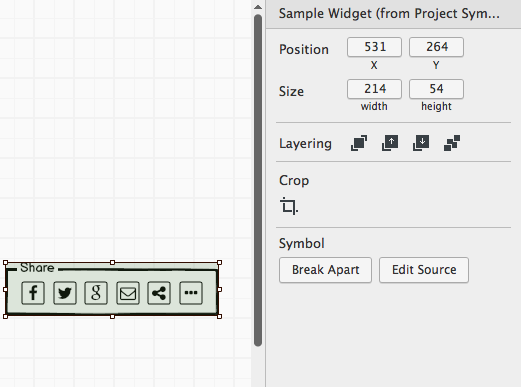
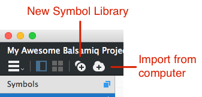
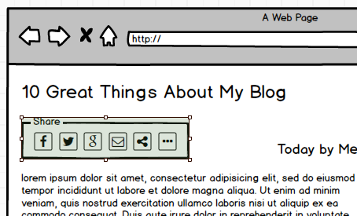
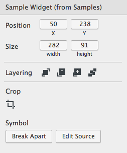
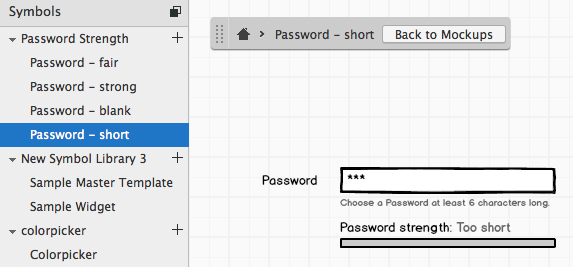
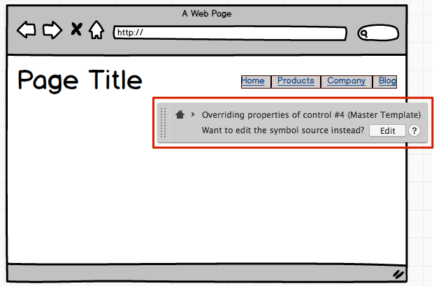
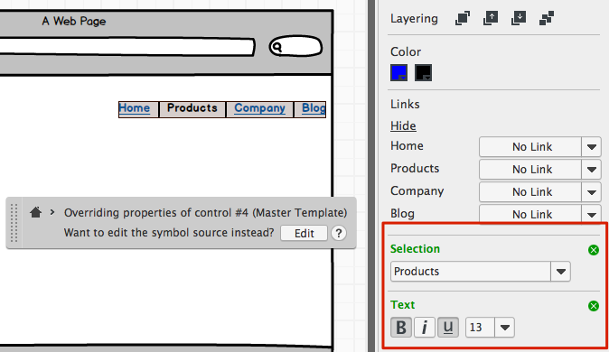
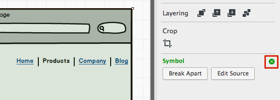
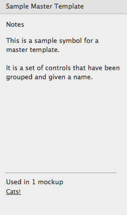

# 使用符号

**最近已经上传完毕！** 
   
这篇网页是为了 [Balsamiq Mockups 3](https://balsamiq.com/products/mockups/) 而上传的。原来的文件您可以点击[这里](http://media.balsamiq.com/files/Balsamiq_Mockups_v1-v2_Docs.pdf)来观看。

Balsamiq Mockups 支持符号的概念。一个符号是一组只有单一功能的控件。它通常用于部分用户的界面，并出现在多个屏幕上。有的其他软件称这个特性为模板，母版页，自定义组件或部件。

从本质上来说，符号让你创建可重用元素，你可以在不同的 Mockups 上使用这些元素。

## 创建符号

这有两种方法来创建符号，描述如下。

### 1.在模型视图创建符号

**在 Mockups 视图创建一个符号时要给你的符号组件进行分组。**你可以创建一个新的分组或使用已经存在的分组。下面的步骤为创建一个新的分组。

1.选择你想要的组件。

2.分组你选择的组件（选择 Edit > Group，单击工具栏中的组图标，或者使用 CTRL/CMD + G）。注意控件将变成蓝色，以显示他们是一组。  
3.给组命名  
4.在属性面板中单击“转换为符号”按钮

你将会注意到选择组会成为浅绿色。这意味着现在选中的是一个符号的实例，并且你可以在你的工程中重用它。

这个新的符号将显示在 UI 库的符号集合中，可以用在你项目中的所有模型中，这样你可以非常容易地将它添加到任何模型当中。

**提示**：一旦创建了一个符号，就像其他控件一样，你也可以通过使用[快速添加](http://support.balsamiq.com/customer/portal/articles/109151#quickadd)，利用其名称的前几个字母来进行添加。

### 2.使用符号视图

Balsamiq mockups 3 是一个专用的视图创建和管理的符号。使用 mockups 视图创建的符号将在这里显示，并且你也可以在这个视图中创建符号。

你可以使用导航图标并选择符号来得到符号视图。你会在左侧的面板列表中看到任何活动的符号。

 

工具栏包括两个图标可以用来创建符号：一个用于创建一个空白画布，另一个则用于[导入](http://support.balsamiq.com/customer/portal/articles/110439#importing)。

单击新符号库图标可以创建一个新的符号库。符号视图显示符号的同时，也会显示符号库容器。在符号视图中你可以在创建之前得知他们的区别。阅读它们的解释。

### 符号与符号库

一个符号库是符号的集合。它能够用来将具有类似特性的符号进行分组。当符号过多的情况时，符号库是用来管理和组织符号的。如果你不是一个符号的专业用户，你可以将符号保持在一个符号库中（然后你可以添加更多的符号库）。

符号视图在他们符号库中以嵌套列表的形式显示，如下所示。

你能选择符号库名称来查看其中所有的符号，或者你可以选择某个符号的名称来仅查看该符号。

当浏览一个符号时，你将会看到一个小浮动栏，其显示链接到符号库的路径。如果你在符号里有分组，这个浮动栏将会帮你导航分组。

符号列表的顶部的图标允许你选择除了你选择的符号外你是否希望看到在符号库中的其他的符号。

**注意**：一个符号所属的符号库会被 UI 库和快速添加中被忽略。无论符号属于哪个符号库，你都将看到你的符号列表。

### 在符号视图中创建符号

在符号视图中创建符号，和在模型视图中创建符号类似，只不过你不需要对它们分组。任何控件添加到符号中都会立即成为其中的一部分。

如上所述,你可以添加一个新的符号到现有的符号库或一个新的库。**要创建一个新的符号，点击符号库右边的 '+' 图标**。这将在那个符号库中创建一个新的符号（比如，叫做 "New Symbol"）。

当你创建一个新的符号库，两个示例符号会自动被创建来帮助你理解符号是怎么工作的。你可以随时修改或删除它们。

**提示**：你可以给符号库本身添加控件，但是这些控件当符号在你的模型中被使用时将不会被显示。像便签一样控件在添加到符号库时能够用于记录符号，不需要在 UI 中显示出来。

## 导入符号

除了在视图中创建符号，你也可以导入在先前版本的 Balsamiq 模型创建的符号。点击导入符号库按钮来打开一个对话框，导入 BMML 格式的文件（模型中使用的格式，比如，[Mockups To Go](http://support.balsamiq.com/customer/portal/articles/131430)）。

导入的符号将被创建在一个新的符号库

## 在你的模型中使用符号

你可以像使用其他控件一样在模型中使用符号。你能够从 UI 库中添加它们，或使用快速添加在你的模型中安置符号和其他控件。

这样的创建方法与先前的方法的主要的区别在于，类似于其他分组控件，符号的属性本身是有限的。

当然，最大的优势是**您所做的任何改变在你使用符号时都会被更新**。请继续阅读，来学习如何编辑符号。

## 编辑符号

当你在模型画布中选中一个符号，你将看到两个符号属性出现在**属性检视视图**中： Break Apart 和 Edit Source。

"Break Apart" 将把符号中的空间和选中的符号本身的连接打断，意味着它不再是一个符号（尽管原始符号完好）。你对分解后的符号的任何改变都不会在其他地方更新，你对一个符号的任何改变在它的分解处也都不会被更新。

"Edit Source" ，它会去做你期望它做的事情，它提供给你可以编辑符号的符号视图。可重复使用的符号的主要好处是，如果你需要作出更改，你只需要在一个地方进行更改即可，它会传播到所有的符号实例（使用中的）中去。当你完成编辑符号时，你可以点击画布上的 "Back to Mockups" 按钮。对符号的编辑将会立即显示在你使用的模型中。

**提示** 你同样可以通过在 UI 库中右击并选择 "Edit Symbol Source" 来进行编辑符号。

## 重写符号属性

一旦你已经创建了一个符号，你每次使用它的时候可能都会想要做一些小小的更改。

例如想象一个你创建主页或模板时的样本,包含一个 web 页面的标题和导航。

你的所有网站页面的标题将含有相同的字体大小和位置，但是标题文本是不同的。同样的，你可以在导航栏中选择哪一个页面会被显示。

符号通过允许你在每一次使用符号时覆盖特定的符号属性来实现这一效果。为此,首先双击符号的 "enter it"。虽然这个过程非常类似于编辑一个分组的内容,但你会发现 Mockups for Desktop 会提醒你,你所做的是正在重写一个符号的某些属性。

此时，你可以操控在符号中的每一个控件，就好像你在编辑一个分组。当你在重写符号属性时，一些操作是不能进行的，比如添加，删除或是控件分组。如果你想要[编辑所有的实例化符号](http://support.balsamiq.com/customer/portal/articles/110439#editing)，单击 "Edit" 按钮。

如果你的操作出现错误，你可以通过撤销来回到上一步操作。如果你想要移除一个属性更改的操作，并且恢复符号的默认属性，你可以单击在属性视图中的绿色的小 "x" 图标。

你同样可以立即撤销你对一个实例化符号的所有操作，只要当你选择整个符号时，在通过属性视图中的 "x" 图标来完成。

## 在项目中使用符号

如果你想要在多个项目中使用相同的符号，你可以将模型代码导出到另一个项目。你同样可以创建一个模板项目，该操作在 [Using Symbols and Assets across Projects](http://support.balsamiq.com/customer/portal/articles/1634821) 中涉及到。

## 管理符号

在符号视图中除了可以创建符号和符号库之外，它也是一个可以管理和组织你的符号的好工具。

你可以通过右侧的[属性面板](http://support.balsamiq.com/customer/portal/articles/109151#propertiespanel)来给你的符号和符号库添加标记。

当一个符号被选中时，较低部分的面板会显示符号在使用的模型（如果有的话）。这可以用来查看你是否可以删除你没有在使用的符号。单击模型名称将会链接到模型视图中的模型中。

### 重命名符号

重命名符号或是符号库时，你可以在左侧的导航栏面板中双击它的名称，或使用[文本菜单](http://support.balsamiq.com/customer/portal/articles/109151#contextmenu)。

### 删除符号

你同样可以使用[文本菜单](http://support.balsamiq.com/customer/portal/articles/109151#contextmenu)从你的项目中删除符号或是符号库。当你删除符号库时，就像是模型或是图像，删除会将它们已送至垃圾箱，在垃圾箱中你可以永久的删除它们，或者是恢复它们。而从符号库中删除一个符号时，删除意味着永久性的删除。

从模型中删除一个符号，就像是图片一样，并不意味着删除符号，而仅仅是一个符号的实例被删除。

### 克隆符号

克隆符号（同样可以通过[文本菜单](http://support.balsamiq.com/customer/portal/articles/109151#contextmenu)）可以在你创建类似的符号或是符号库时为你节约宝贵的时间。
