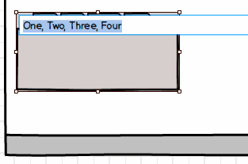
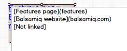

# 使用文本控件

**最近已经上传完毕！** 
   
这篇网页是为了 [Balsamiq Mockups 3](https://balsamiq.com/products/mockups/) 而上传的。原来的文件您可以点击[这里](http://media.balsamiq.com/files/Balsamiq_Mockups_v1-v2_Docs.pdf)来观看。

许多 Mockups UI 控件，像按钮、标签或者数据网格，里面都包含文本。双击控件并输入内容来修改文本。或者，如果你选中了控件，只需按一下回车或者 F2 就可以开始编辑了。单击除了你输入内容的文本框之外的任何一个地方或者按回车或 CTRL + 回车都可以保存编辑。如果你想要放弃对文字的更改，按 Esc 键即可。  
有些控件使用某一字符作为分隔符。例如，在标签栏创建多个标签，你可以用逗号分隔它们。  

  

或者，在 Tag Cloud 控件中使用一个空格字符来分隔标签。一些其它控件，比如树，使用其它字符。在这样的情况下，控件的默认文本包含了如何使用它的说明。  

在编辑 Label 或 Paragraph 控件时，你会发现在编辑框的右下角有一个小数字。这是字符数，这在书写文案或其它情况下很有用。  

## 基本格式

### 文本样式

你可以使用下列符号来格式化你的标签文本的某一部分。

- 对于斜体字，使用 \_this notation\_
- 对于超链接，使用 [this notation]
- 对于加粗，使用 \*this notation\*
- 对于有缺陷的，使用 -this notation-
- 对于下划线，使用 &this notation&
- 对于删除线，使用 ~this notation~
- 对于颜色，使用 {color:#FF0000}this notation{color}
- 对于字号，使用 {size:16}this notation{size}

上述所有的语法作用的文字必须用空格分开，而且下划线作用单位为单词。  

>注释：  

>1. 上面的 #FF0000 是 HEX 格式的颜色，与 HTML 中一样。宏可以有 # 号，也可以没有。你也可以使用确切的颜色名（例如 green , yellow 等），你可以移动鼠标到 Property Inspector 上的调色板来找到它们的名字。  
>2. 看[下一个小节](http://support.balsamiq.com/customer/portal/articles/110121-working-with-text#linking)来了解如何将[链接文本]转变成具有跳转至网站或者其它 mockups 的功能。  
>3. 这些格式化语法同样作用于输入到[注释面板](http://support.balsamiq.com/customer/portal/articles/110114#notes)上的文本，除了斜体和删除线。

这有一个截图显示了上述文本在 Paragraph 控件中的样子，例如：


快捷方式几乎在任何更直观的地方都能见到，你可以组合使用上述语法，就出现了斜体加下划线的字，[_this_] 或者 _[this]_。  

一些控件像 Paragraph 或 Label 允许你经过属性检视视图选择不加粗。如果你那么做了，那么\*加粗字\*还会保持加粗。一些控件默认使用加粗字体，所以在那些控件中使用加粗字体不会用任何变化。  

如果你需要使用特殊的格式字符作为实际字符显示，你需要将 *, _, -, [ 和 ] 替换为  \*, \_, \-, \[ 和 \]，所以如果你想要显示 "this [is] some text" 并且不想让 "is" 变成一个连接的话，就需要输入 "this \[is\] some text"。

### 换行符

大多数控件允许你插入换行符使光标从这一行跳转到下一行。你可以通过在新一行的内容前加 \r 来实现。看下面的一个例子，换行符使用在单选按钮组的第二个元素上。


### 项目符号列表

在一个段落控件中，你可以通过以连字符或者星号加空格开头来创建一个项目符号列表。

```
\* item1  
\* item2  
\- item3  
\- item4  
```

### 使文字中的链接生效

如果你使用了上述的链接符号（比如，[这是一个链接]），你可以通过 [markdown 语法](http://daringfireball.net/projects/markdown/syntax)使链接格式文本成为一个真正的链接。 

**将链接地址放在括号里写在链接文本的后面**就可以实现功能了。链接地址可以是 URL，也可以是在相同目录下另一个 mockup 的名字。下面的这些形式都是有效的。  

网站地址：  

```
[Balsamiq Website](balsamiq.com)
[Balsamiq Website](www.balsamiq.com)
[Balsamiq Website](http://www.balsamiq.com)
[Balsamiq Website](http://balsamiq.com)
```

同一项目中的 Mockups ：

```
[Features Page](features)

```

使用这一方法添加链接会使它们在属性检视视图中也显示出来，如下图所示。  

文本：  



结果：  


你可以链接整个控件中的指定字符串。  

>注释：如果整个控件被链接了，文本链接会失效。如果整个控件后来被释放链接，那么之前的文本链接又会回来。

## 更多宏命令

### lorem

在 Paragraph 或 Text Area 输入 lorem 来使用我们的 [Lorem Ipsum](http://www.lipsum.com/) 发生器。  


### {mockup-name}

在 Label, Text, Title 或者 Subtitle 控件中输入 {mockup-name} (所有小写字母) 会显示当前 mockup 的名字。
